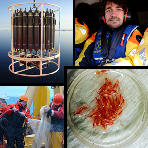
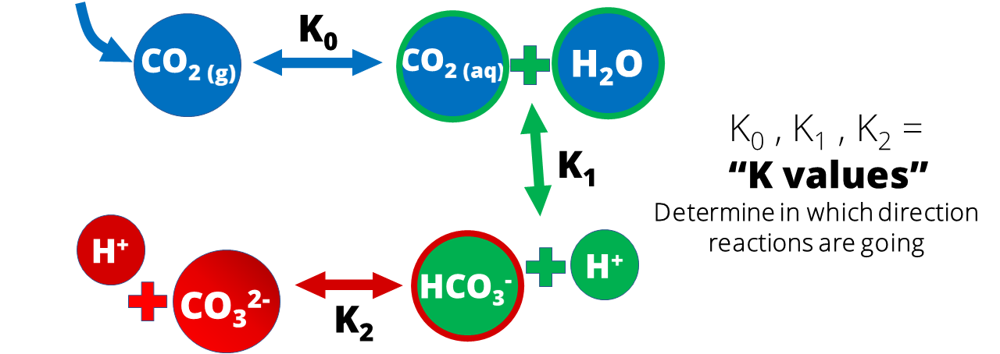
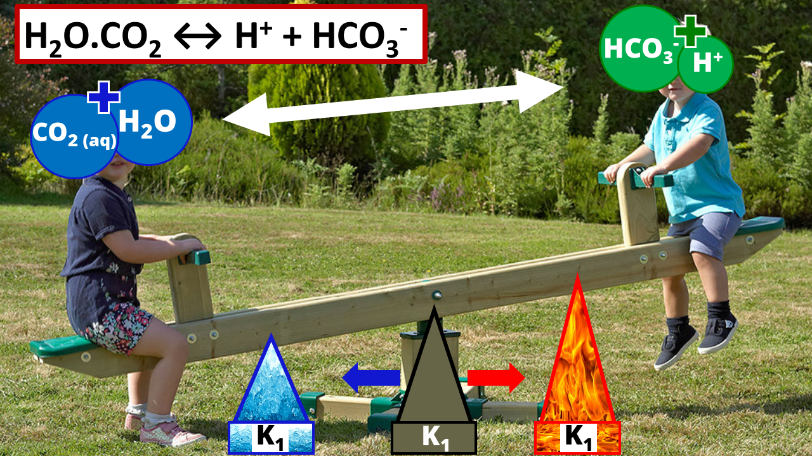
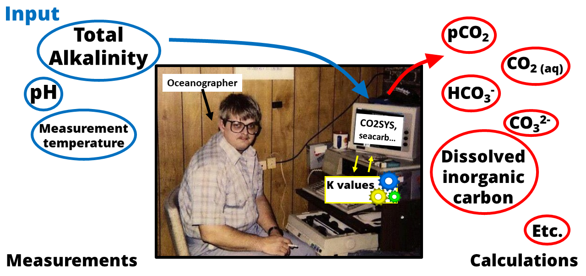

## Project status [**done**]

## **North-West Passage**

Juan de Fuca, who gave his name to a [tectonic plate](https://www.nationalgeographic.com/science/2019/07/tectonic-plate-dying-oregon-why-matters/), a [strait](https://www.worldatlas.com/aatlas/infopage/juandefuca.htm), and a [50-m tall rock](https://www.mountainproject.com/route/113155505/fuca-pillar), was a famous Greek explorer who may actually have [never existed](https://en.wikipedia.org/wiki/Juan_de_Fuca#Controversy). Fuca was looking for new ways to reach from Europe the land of Genghis Khan as described by Marco Polo. Instead of going East, like Polo did, he tried to look for the mythical North-West passage. 

A few decades after Colomb's trips to America, two ways to the Pacific were already known: the Strait of Magellan at the south of Chili, and the Isthmus of Panama. An alternative, North-West passage, which would be closer to Europe, was yet to be discovered. Generations of marine explorers had tried since the 1250s to find the entrance of the North-west passage, with attempts from both the Atlantic and the Pacific sides. In 1592, Juan de Fuca, after one of his expeditions, described the entrance of a passage on the west coast of Canada, through which he sailed for 20 days, before turning back. That passage, which he claimed to be the North-West passage, made sailors fantasize for centuries. It was only in 1792 that [George Vancouver](https://en.wikipedia.org/wiki/George_Vancouver) found out the truth about the passage discovered by Juan de Fuca: it was not the North-West passage, but simply a path around the Vancouver island. According to Vancouver, there were no North-West passage south of the Bering strait. 

It is only in the early 20th century, after the [Franklin's lost expedition](https://secretsoftheice.com/news/2019/10/28/franklin-expedition/), that Roald Amundsen became the first man who successfully navigated the [North-West Passage](https://www.youtube.com/watch?v=TVY8LoM47xI) by boat, on a voyage that lasted from 1903 to 1906.



Here are a couple of pictures about expeditions I have been involved in, in the Canadian Arctic between 2016 and 2019, where I was measuring seawater pH, total alkalinity and surface pCO2 as a part of the [Arcticnet](https://arcticnet.ulaval.ca/) program.



In the winter, when seawater is brought back on the deck and in contact with cold air at - 20 or - 30 degrees Celcius, it is only a matter of seconds before it starts freezing. One must act fast!



pH measurements are usually performed on board, at a temperature of 25 degrees Celcius. One one hand, one would want to measure seawater pH fast after sampling, to avoid CO2 exchanges with the air. On the other hand, it may take several long minutes before a seawater sample warms up and reaches a stable temperature. This, combined with the challenge of sampling seawater in sea ice covered regions, makes pH measurements from cold water regions challenging to obtain. 





## **CO2 system in cold water**







