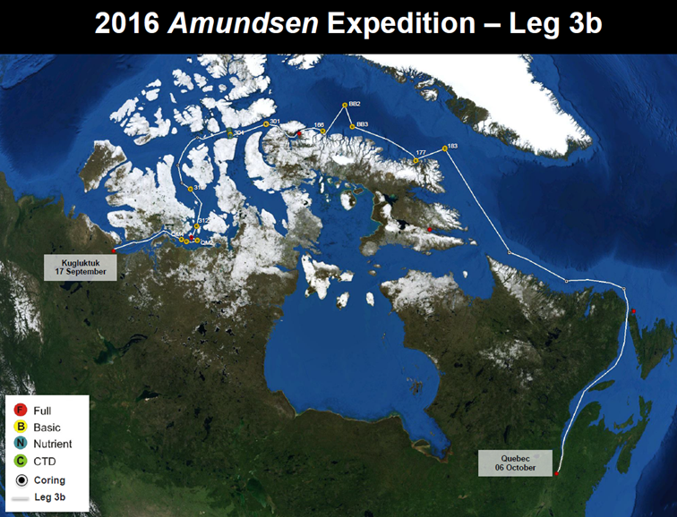
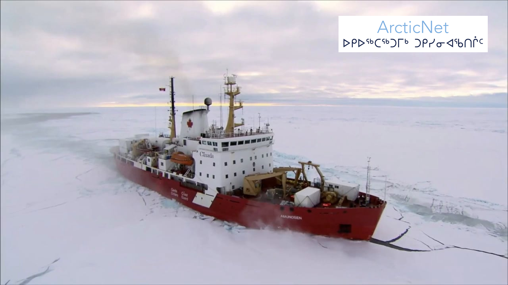
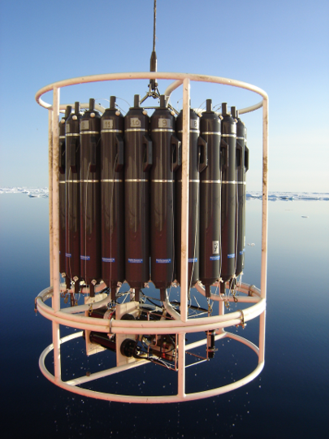
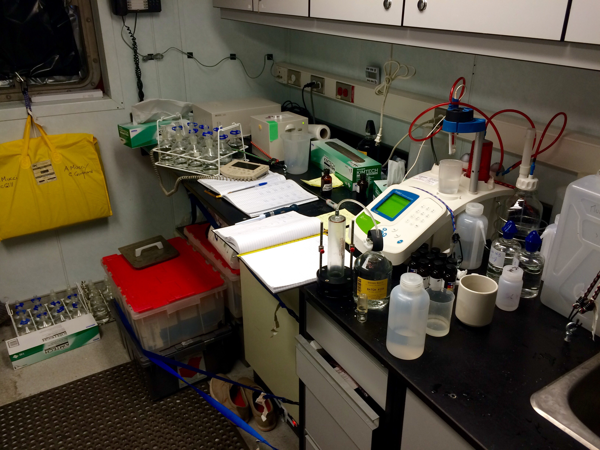
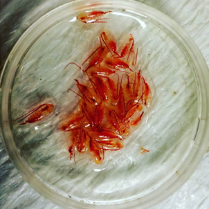
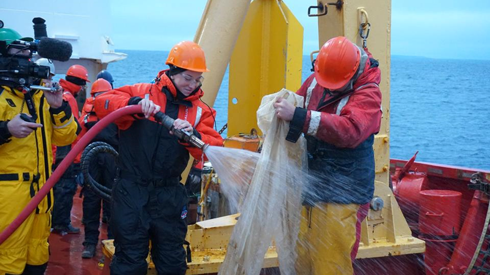
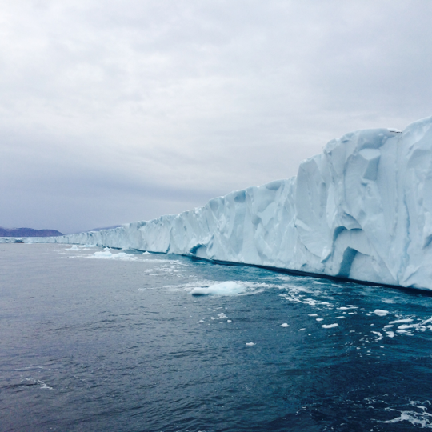

## Project status [**done**]

Under construction

## North-West Passage













Phytoplankton, or plants that can't swim, need sunlight and nutrients to live and be happy. In the Arctic, in the winter, because there are ice sheets covering the surface ocean, the amount of sunlight reaching the water is very small and plankton cannot grow. Nutrients stay there, waiting to be eaten. When the ice sheet melts in the spring, there is suddenly plenty of light reaching the surface waters. Plankton get super excited and eat all the food. This lasts a couple of weeks and then they die, not because there is no light because they have eaten all the food. Nutrients are replenished slowly, brought by dust and rivers, but by the time enough food is back into the surface ocean, it's winter again, there is no light any more. Then spring comes again, ice melts, plankton eat all the food, they die. It happens every year. But why don't they go more slowly on eating food when the spring comes, you ask? Don't they ever learn from their mistakes? Well, not really, they have no brain. They think short term, and live an intense life, using all their resources at once, without thinking about future generations. Does that remind you of someone?





SLE, Arctic

## Saint Lawrence Estuary

OS paper

## CO2 exchanges at the air-sea interface

Blabla

## Revised equilibrium constants?

Next: Pitzer?
