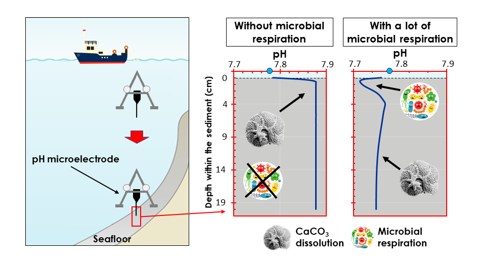

## Project status: [**funded**]

## **Why**?

The seafloor, which covers ~70% of the surface of the planet and moderates the transfer of materials and energy from the biosphere to the geosphere, remains for the vast majority unexplored and unmapped. Today, this rich, unknown ecosystem is locally threatened by deep-sea mining activities, e.g. by ploughing of the top layers of the seabed, which contains abundant valuable minerals and metals essential to the energy transition [1]. The deep ocean is also perturbed globally by climate change, including seawater acidification caused by the addition of ~ 10 billion tons of human-made carbon dioxide (CO2) per year into the oceans.

Ocean acidification, which refers to the observed decrease in seawater pH [2], promotes the dissolution of calcium carbonate (CaCO3) minerals, plentiful at the seabed. CaCO3 minerals are the main constituents of the shells of many planktonic organisms, and these accumulate at the seafloor upon their death. For every molecule of CaCO3 that dissolves, about one molecule of CO2 is being neutralized. As there are far more CaCO3 minerals stored in marine sediments than human activities can potentially release as CO2, CaCO3 dissolution at the seafloor will be the ultimate sink for anthropogenic CO2 on timescales of decades to millennia [3]. Thus, knowing the rate at which anthropogenic CaCO3 dissolution will occur is required to predict future ocean acidification and take adequate mitigation actions.

Yet, the key processes that govern CaCO3 dissolution at the surface of the seafloor are still obscure: it involves chemistry, physics and biology. Physical processes (tides and other sea currents) determine the near-bottom hydrodynamics and thus the transfer of materials to and from the bottom. The bottom-water chemistry sets the thermodynamic drive (degree of undersaturation of carbonate minerals) [4]. Fresh organic matter delivered to the sediments is degraded by microbes and other consumers, resulting in the release of respiratory carbon dioxide. This locally acidifies the sediment porewaters (the water between the sediment particles), which, in principle, could cause some of the CaCO3 particles to dissolve. Because the deep seafloor is mostly uncharted, and its many of its inhabitants are yet to be discovered, it is virtually impossible to model and thus accurately predict the role of respiratory carbon dioxide in sediment CaCO3 dissolution, nor how this will evolve in the future.

## **What**?

Two main research questions pop up: **1)** What is the relative importance of physical, chemical and biological processes in sediment carbonate dissolution? **2)** Can in situ microscale observations of pH and oxygen quantify respiration-driven calcite dissolution ?

Microbial respiration consumes dissolved oxygen and releases CO2, the latter inducing a seawater pH decrease. However, dissolution of CaCO3 grains in marine sediments releases carbonate ions (CO32-), which increases seawater pH. Thus, by measuring pH in sediment porewaters, the impact of microbial respiration and CaCO3 dissolution can be studied. By microprofiling dissolved oxygen at the same time , one can quantify microbial respiration and in this way attribute pH changes to calcite dissolution with or without respiration. Microelectrodes, which are sensors able to measure concentrations of dissolved species at a micrometer resolution, are best suited for these purposes. In shallow environments, such as lakes and the continental shelf, one can collect sediment samples and perform microelectrode measurements on board. At the deep seafloor, several kilometres of overlaying seawater generates a very high hydrostatic pressure, and microelectrodes measurements need to be carried out in situ, by inserting them in the top centimetres of the seabed, as bringing samples back on the ship would cause depressurization and warming, triggering chemical reactions, and sacrificing biological activity. Performing in situ measurements several kilometres below the sea surface poses significant analytical and logistic challenges, which is why in situ observations are so scarce.



Obtaining direct measurements of oxygen and pH in CaCO3-rich sediments, under a range of seafloor depths and labile carbon inputs, would be unprecedented, and this is the research that we propose here. The overarching hypothesis to be tested is the following: Respiration driven dissolution of CaCO3 minerals in the top centimeters of sediments is correlated to the flux of organic matter reaching the seafloor. This hypothesis will be tested by:

**1)** using **microelectrodes** to measure in situ pH and oxygen concentrations in the top centimeters of the seabed, with a high vertical resolution, at several deep-sea sites, and

**2)** recovering **sediment cores** to measure the amount of organic matter, CaCO3, and phytopigments (indicators of the freshness of the settling organic matter), and to characterize the microbial community.

## **When** and **where**?

The proposed research will be performed on a NSF-funded research cruise in the Pacific Ocean, north of the Galapagos. The cruise will take place in November 2020 and is scheduled to last ~ 40 days, covering sites with a very broad depth range (~1500 to ~4500 m) and other participants will provide auxiliary data to optimally put our results in context. This area is scientifically interesting because it has some of the highest vertical fluxes of CaCO3 and organic matter reaching the seafloor beneath [5]. Besides, the seafloor in this area contains numerous deposits of iron and manganese [6], therefore being under the threat of deep sea mining companies and our data will provide the baseline for any future environmental assessment studies.
Microelectrodes will be sent to the seafloor via a lander sinking through the water column. After the automated measurements, the lander will float back to the surface and be recovered by the ship, communicating its location by satellite. Sediment cores will be collected, sliced into thin vertical sections, and stored for further analyses. Inorganic and organic carbon contents will be measured by an elemental analyser (before and after acidification), phytopigments will be quantified by fluorometry/HPLC and microbial communities will be characterized using DNA and lipids analysis.

This project is funded by **NWO** through a XS grant to O.S. Thanks NWO!

## References
**[1]** Thompson et al. (2018) Front. Mar. Sci. 5 **[2]** Lauvset et al. (2015) Biogeosciences 12 (5) **[3]** Archer (2005) J. Geophys Res. 110 (C9) **[4]** Peterson (1966) Science 154 (3756) **[5]** Dunne et al. (2012) Global Biogeochem. Cy. 26 (3) **[6]** Dutkiewicz et al. (2020) Geology, doi:10.1130/G46836.1