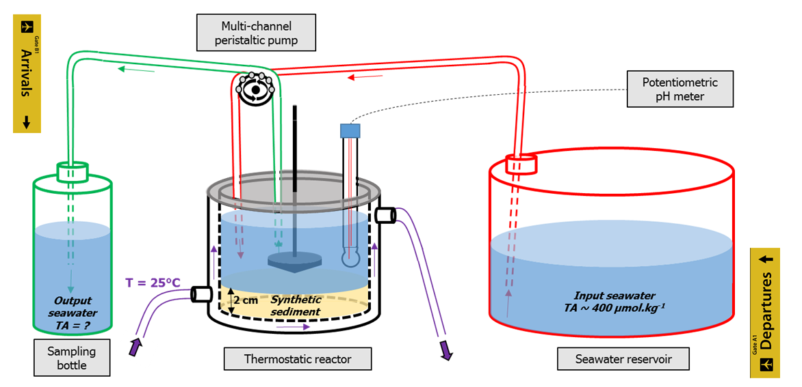
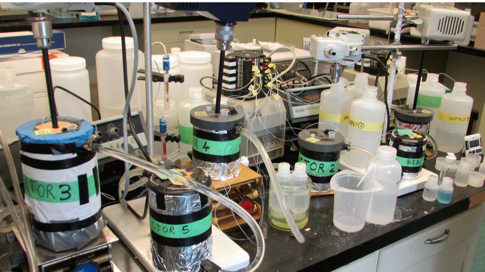
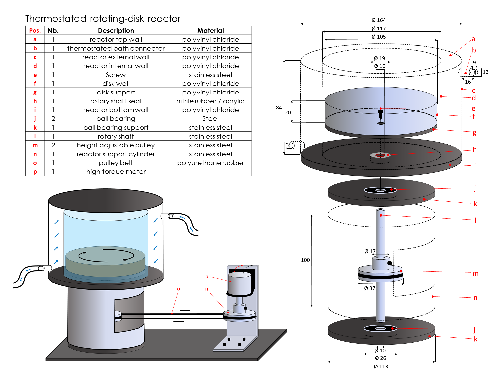

## Project status [**in progress**]

**Publications**
- [x] Marine Chemistry: [Calcite dissolution kinetics at the sediment-water interface in natural seawater](https://osulpis.xyz/publication/journal-article/mc2017/)
- [x] Limnology and Oceanography-Methods: [Controlling the diffusive boundary layer thickness above the sediment water interface in a thermostated rotating disk reactor](https://osulpis.xyz/publication/journal-article/lom2019/)
- [x] Geochimica et Cosmochimica Acta: [Control of CaCO3 dissolution at the deep seafloor and its consequences](https://osulpis.xyz/publication/journal-article/gca2020/)
- [ ] In preparation for resubmission: Impact of environmental conditions and sediment properties on the dissolution kinetics of natural and synthetic calcites in the laboratory

///////////////

## **Phase 1**: High-energy environments [McGill University]

In many situations, boundary conditions are critical in defining the hydrodynamics of natural environments. In limnology and oceanography, the bottom (or benthic) boundary layer is the part of the water column that is directly affected by the drag of currents on the sediment bed; its thickness is typically on the order of meters to tens of meters. Within this bottom boundary layer, current velocities decrease toward the sediment bed, until ultimately reaching zero velocity relative to the solid boundary at the sediment–water interface of low-permeability sediments. Just above the sediment-water interface, in a thin film of water with a thickness typically on the order of a few tens of microns (e.g., in rivers or coastal areas) to millimeters (e.g., in lakes or abyssal environments), molecular diffusion becomes the dominant mode of solute transport, rather than much faster turbulent diffusion, which dominates solute transport further away from the interface. This layer is termed the diffusive boundary layer (**DBL**). The thickness of this DBL depends on the nature and roughness of the substrate, as well as on the current speed of the overlying water. Slow currents generate thick DBLs, whereas fast currents cause the DBL to thin, as predicted by theory and confirmed by observations.

Reactions under the sediment-side controlled regime, i.e., occuring slowy and thus not strongly limited by diffusion through the DBL, include the dissolution of biogenic silica at the seafloor or the release of soluble reactive phosphate from lacustrine sediments. Examples of water-side transport-controlled reaction are the dissolution of calcium carbonate at the deep-seafloor and the accretion of manganese at the surface of deep-sea nodules. Commonly, the diffusion through the DBL of most solutes is ruled by a combination of both regimes, termed mixed-control, e.g., dissolved oxygen or radon, that display concentration gradients extending on both sides of the sediment-water interface.

In high-energy environments, such as carbonate platforms or coral reefs, bottom current are fast, turbulence is common, and the DBL is very thin or inexistant. To simulate chemical exchanges across the sediment-water interface in such environments, a flume or a stirred reactor is adapted. Here is an example of experimental setup reproducing high-energy benthic environments:







## **Phase 2**: Deep-sea-like hydrodynamic conditions [McGill University]



## **Phase 3**: Effects of organic matter and mineralogy on carbonate mineral dissolution [NIOZ]

Funding was received from [NIOZ](https://www.nioz.nl/en/education/uu-nioz-student-work-experience-1) to hire a student and pursue a research summer-project about the **effects of organic matter and mineralogy on carbonate mineral dissolution**. This should take place in summer 2020 or 2021 in collaboration with [Dr. Matthew Humphreys](https://mvdh.xyz/).

Background:
The shells of many planktonic organisms are composed of carbonate minerals (e.g. CaCO3). These cover a large part of the seafloor where they act as a giant antacid tablet, protecting the oceans against human-made acidification caused by CO2 emissions. Environmental conditions representative of the deep sea can be generated in the laboratory using new rotating-disc reactors, in which discs loaded with sediment are rotated in a chamber of seawater. Recent studies with these reactors have shed new light on the relative importance of different controls on the dissolution rate, with significant consequences for projections of future ocean acidification. However, the effects of varying sediment mineralogy and the presence of organic matter remain to be quantified.

Work description:
We plan to build a set of rotating-disc reactors at NIOZ in spring 2020 (i.e. before the student arrives), in collaboration with colleagues from McGill University (Montreal, Canada). The student would run dissolution experiments using sediments and seawater collected/stored at NIOZ, comparing the results with previous studies in order to validate the method and investigating previously untested sediment compositions. The dissolution reactions will be monitored by the student using the NIOZ carbonate system laboratory facilities.

**Stay tuned!**

## **What's next?**

Here are some of the analytical developments that could be implemented:
- Continuous flow analysis
- Foil
- Microelectrodes from above and below

[Get in touch](https://osulpis.xyz/#contact) if you are interested. 
