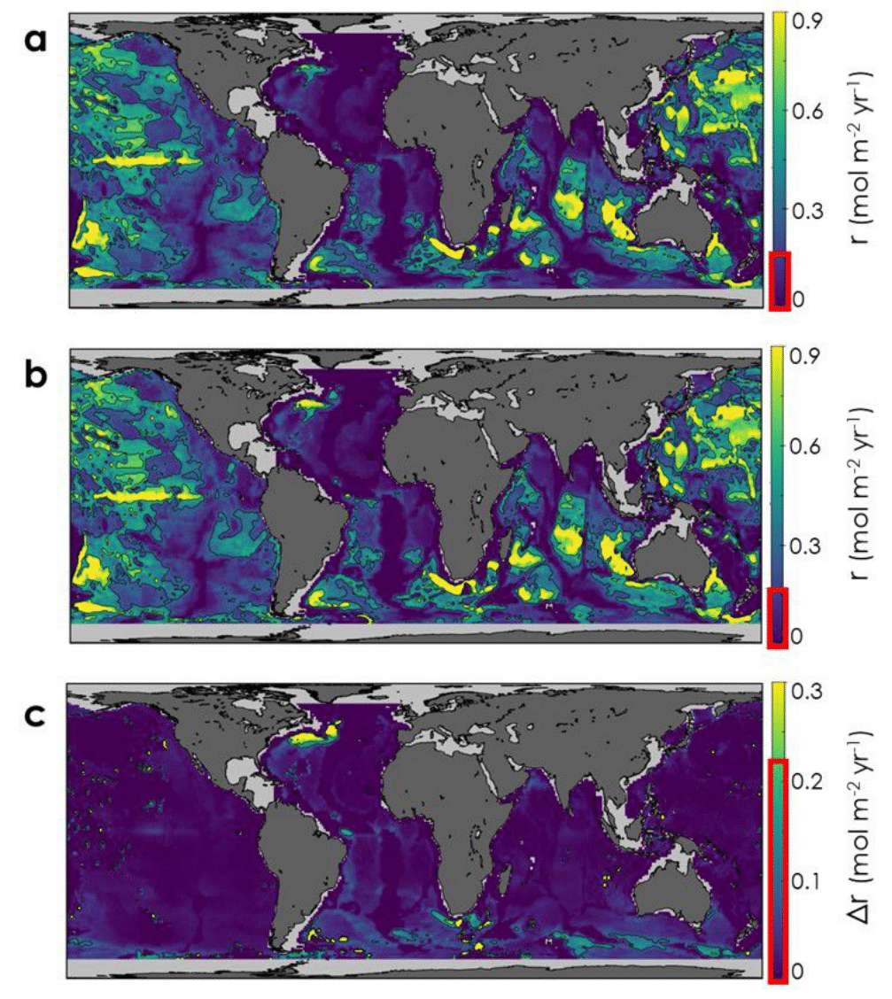
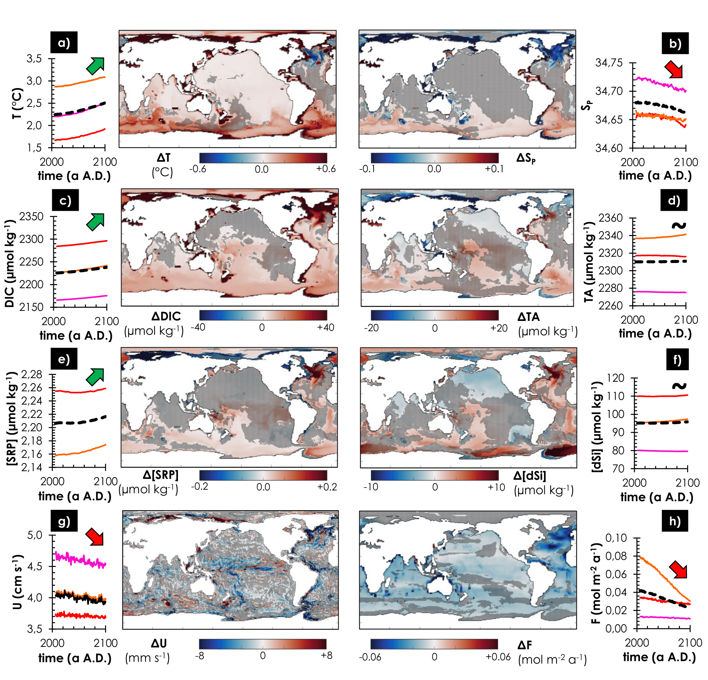

## Status: [**in progress**]

**Publications**
- [x] PNAS: [Current CaCO3 dissolution at the seafloor caused by anthropogenic CO2](https://osulpis.xyz/publication/journal-article/pnas2018/)
- [x] Global Biogeochemical Cycles: [Reduced CaCO3 Flux to the Seafloor and Weaker Bottom Current Speeds Curtail Benthic CaCO3 Dissolution Over the 21st Century](https://osulpis.xyz/publication/journal-article/gbc2019/)

## **Carbonating the ocean**

Carbon dioxide (CO2) in the atmosphere is absorbed by our oceans, and has an important impact on our oceanic ecosystems. When an ocean absorbs CO2 in large quantities its chemistry changes, and it becomes more acidic. However, the oceans have their very own antacid: a mineral called calcium carbonate, which comprises the exteriors of some marine organisms - clams, oysters, starfish, coccolithophores, coral, and others. Like an antacid, these minerals help to buffer the acidity of the ocean by dissolving and producing a charged molecule called carbonate, which can effectively neutralize acid.

## **The seafloor is dissolving because of humans**

The geological record contains numerous examples of greenhouse periods and ocean acidification episodes, where the spreading of corrosive (CO2-enriched) bottom waters enhances the dissolution of CaCO3 minerals delivered to the seafloor or contained within deep-sea sediments. The dissolution of sedimentary CaCO3 neutralizes excess CO2, thus preventing runaway acidification, and acts as a negative-feedback mechanism in regulating atmospheric CO2 levels over timescales of centuries to millennia. We report an observation-based indication and quantification of significant CaCO3 dissolution at the seafloor caused by man-made CO2. This dissolution is already occurring at various locations in the deep ocean, particularly in the northern Atlantic and near the Southern Ocean, where the bottom waters are young and rich in anthropogenic CO2.



This research, published in **PNAS**, has received broad media coverage with more than 170 press articles from 38 countries. Read a selection of articles on the topic:
- [Vice](https://www.vice.com/en_us/article/d3qaek/the-seafloor-is-dissolving-because-climate-change)
- [Smithsonian Mag](https://www.smithsonianmag.com/smart-news/parts-ocean-floor-are-disintegrating-180970706/)
- [NBC News](https://www.nbcnews.com/mach/science/climate-change-may-be-dissolving-ocean-floor-here-s-why-ncna935261)
- [Daily Mail](https://www.dailymail.co.uk/sciencetech/article-6334309/The-ocean-floor-DISSOLVING-rapidly-study-warns-human-activity-blame.html)
- [Gizmodo-Earther](https://earther.gizmodo.com/human-carbon-emissions-are-dissolving-the-ocean-floor-1830178302)
- [I.F.L. Science](https://www.iflscience.com/environment/our-oceans-are-becoming-so-acidic-it-could-dissolve-the-seabed/)

## **Forecast for the 21st century**: warm, sluggish and muddy

Carbon dioxide (CO2), produced and released to the atmosphere by human activities, has been accumulating in the oceans for two centuries and will continue to do so well beyond the end of this century if emissions are not curbed. Model projections for the 21st century, under a business as usual scenario, reveal that seawater will become more corrosive to this mineral, but calcite dissolution at the seafloor will only increase slightly due to reductions in bottom-current speeds and in the amount of calcite particles delivered to the seafloor over that period. These results indicate that the neutralization of human-made CO2 by calcite dissolution at the seafloor may take longer than previously anticipated.

{{< figure src="" title="Changes in bottom-water (a) temperature (T), (b) practical salinity (Sp), (c) dissolved inorganic carbon concentration (DIC), (d) total alkalinity (TA), (e) soluble reactive phosphate concentration ([SRP]), (f) dissolved inorganic silica concentration ([Si]), (g) bottom-current speed (U), and (h) calcite flux to the seafloor (F) between the first 30 years (2006 2035) and the last 30 years (2071 2100) of the CMIP5 model mean, under the RCP8.5 scenario. **source: [Global Biogeochemical Cycles](https://agupubs.onlinelibrary.wiley.com/doi/abs/10.1029/2019GB006230)**" >}}

This research was published in [Global Biogeochemical Cycles](https://agupubs.onlinelibrary.wiley.com/doi/abs/10.1029/2019GB006230). Here are the **main take-home messages**:

- Models underestimate bottom current speeds relative to observations. The discrepancy declines as model horizontal resolution increases; however, **all tested models indicate slower bottom-water circulation by the end of the century**.

- There are large discrepancies between tested models in the CaCO3 sinking flux magnitude for particles that reach the sea floor. **All tested models project declines in the CaCO3 sinking flux** through the end of the century.

- Reduced CaCO3 particle fluxes and increased CaCO3 dissolution rates cause the **CCD to rise** by **800 m by the end of the century**. This causes **~20% of the seafloor to switch from net CaCO3 accumulation to net CaCO3 dissolution**.

- Future research efforts should focus on developing sediment modules inclusive of bioturbation, organic matter degradation, and mass transfer through a diffusive boundary layer of variable thickness to improve estimates of seafloor CaCO3 dissolution.

## **What's next?**

The good news is that there are far more calcium carbonate at the seafloor than there are carbon dioxide under the form of fossil fuel that we can possibly burn. The bad news is that there is there is not a single place on Earth that cannot feel human activity.

Here are the research questions I am hoping to see an answer to:
- What is the impact of more organic matter to the seafloor on calcium carbonate in surface sediments?
- To what extent the alkalinity signal from seafloor dissolution can be felt in the water column?
- How will burrowing organisms evolve in the future and how will this affect early diagenesis?

[Get in touch](https://osulpis.xyz/#contact) if you are interested in it too. 

